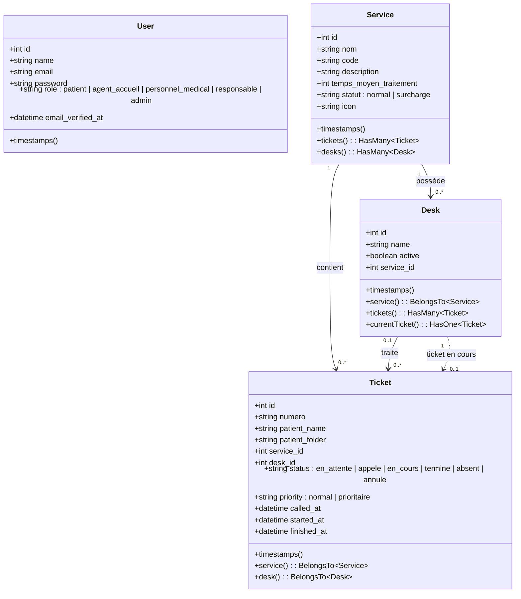
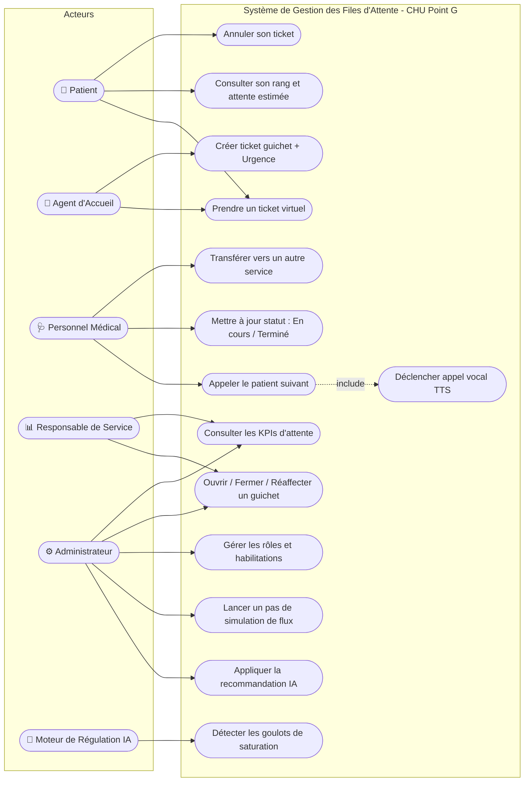
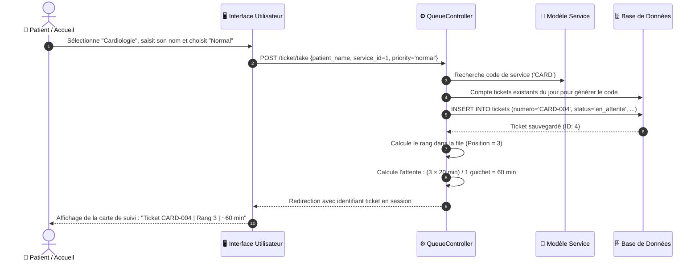
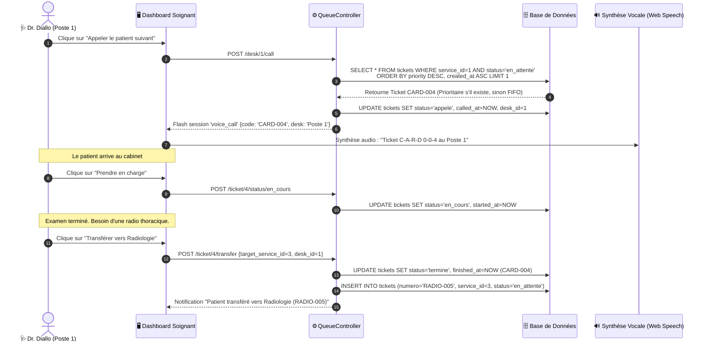
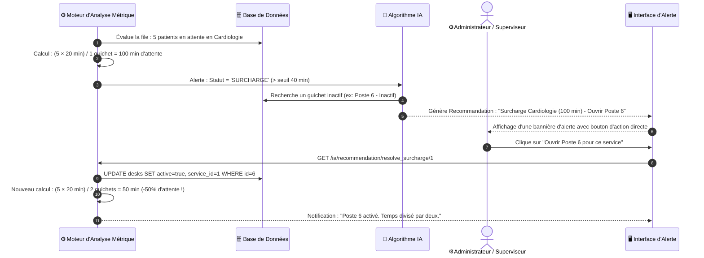

# 🏥 DOSSIER DE PRÉSENTATION & SPÉCIFICATIONS TECHNIQUES
## Système Intelligent de Gestion des Files d'Attente et des Flux Patients
**Centre Hospitalier Universitaire (CHU) du Point G — Bamako**

---

## 📋 Sommaire Exécutif

1. **Contexte & Enjeux Stratégiques**
2. **Architecture des Rôles : « Qui fait quoi ? »**
3. **Modèle de Données & Diagramme de Classes UML**
4. **Diagramme des Cas d'Utilisation UML**
5. **Diagrammes de Séquence des Processus Critiques**
6. **Algorithmes & Logique d'Intelligence Opérationnelle**
7. **Guide de Démonstration Pas-à-Pas pour la Réunion Client**

---

## 1. Contexte & Enjeux Stratégiques

### 1.1 La Problématique Actuelle
Dans les structures hospitalières à fort trafic comme le **CHU du Point G**, la gestion manuelle ou archaïque des flux patients entraîne des goulets d'étranglement critiques :
- **Attente physique pénible :** Les patients attendent debout ou entassés dans des couloirs sans visibilité sur leur heure de passage.
- **Tensions et stress :** Incompréhension face à l'ordre de passage, sentiment d'injustice, risque de disputes.
- **Ressources médicales mal équilibrées :** Certains services sont débordés (ex: Cardiologie ou Caisse), tandis que d'autres guichets disposent de capacités sous-exploitées.
- **Absence de traçabilité :** Impossibilité d'évaluer le temps moyen de prise en charge ni d'identifier les pics d'affluence.

### 1.2 La Solution Apportée
L'application **Système Intelligent de Gestion des Files d'Attente du Point G** transforme radicalement l'expérience hospitalière :
1. **Délivrance de tickets virtuels & physiques** avec numéro unique et catégorisation (Normal vs Prioritaire).
2. **Information en temps réel :** Affichage du rang dans la file et estimation dynamique du temps d'attente restant.
3. **Appels vocaux automatisés** (Text-to-Speech) et moniteur central d'affichage pour une accessibilité universelle.
4. **Transfert direct inter-services :** Un médecin peut orienter instantanément son patient vers la radiologie ou le laboratoire sans refaire la queue à l'accueil.
5. **Module de Régulation IA :** Détection proactive des surcharges ($\ge 40$ min d'attente) avec proposition de réallocation automatique des guichets inactifs ou sous-chargés.

---

## 2. Architecture des Rôles : « Qui fait quoi ? »

L'application repose sur une séparation stricte des responsabilités à travers **5 profils d'utilisateurs** :

```
                               ┌────────────────────────────────┐
                               │   Système Hôpital du Point G   │
                               └───────────────┬────────────────┘
         ┌───────────────────┬─────────────────┼─────────────────┬──────────────────┐
         │                   │                 │                 │                  │
         ▼                   ▼                 ▼                 ▼                  ▼
    👤 Patient          🏢 Accueil        🩺 Médical        📊 Responsable     ⚙️ Administrateur
```

### 👤 Profil 1 : Le Patient (Usager)
*Exemple de compte démo : `patient@pointg.ml` / Nom : Amadou Touré*
- **Prise de ticket virtuel :** Sélectionne son service de consultation souhaité depuis son smartphone.
- **Suivi dynamique de son statut :** Consulte son rang exact dans la file et le temps d'attente estimé en minutes.
- **Alerte de convocation :** Est notifié visuellement lorsque son ticket est appelé au guichet correspondant.
- **Autonomie :** Peut annuler son ticket en cas d'empêchement, libérant automatiquement sa place pour les autres.

### 🏢 Profil 2 : L'Agent d'Accueil (Guichetier d'Orientation)
*Exemple de compte démo : `accueil@pointg.ml` / Nom : Fatoumata Traoré*
- **Inclusion numérique :** Émet des tickets pour les usagers ne disposant pas de smartphone ou ayant besoin d'assistance.
- **Saisie du dossier patient :** Renseigne le numéro de dossier médical pour assurer la continuité des soins.
- **Gestion des priorités :** Qualifie l'urgence du patient (**Normal** ou **Prioritaire** pour les urgences relatives, personnes âgées, femmes enceintes, nourrissons).

### 🩺 Profil 3 : Le Personnel Médical & Soignants (Médecins, Infirmiers, Laborantins)
*Exemple de compte démo : `medecin@pointg.ml` / Nom : Dr. Diallo*
- **Affectation de poste :** Sélectionne le guichet / bureau physique dans lequel il exerce (ex: *Poste 1 - Médecine*).
- **Appel du patient suivant :** Déclenche l'appel selon un algorithme qui privilégie d'abord les urgences, puis l'ordre chronologique d'arrivée (FIFO).
- **Annonce vocale synchronisée :** L'appel active le diffuseur sonore hospitalier ("*Ticket CONS-001 demandé au Poste 1*").
- **Cycle de consultation :**
  - Marque le patient comme **"En consultation"** au moment de son entrée dans le cabinet.
  - Marque le patient comme **"Terminé"** à la fin de la séance.
  - Signale le patient comme **"Absent"** s'il ne s'est pas présenté.
- **Transfert inter-services :** Réoriente le patient vers un autre service (ex: Radiologie) en générant automatiquement son nouveau ticket sans repasser par l'accueil.

### 📊 Profil 4 : Le Responsable de Service (Cadre de Santé / Superviseur)
*Exemple de compte démo : `responsable@pointg.ml` / Nom : Chef de Service*
- **Tableau de bord de pilotage :** Vision globale sur le flux des patients par service, le taux d'occupation et l'attente moyenne.
- **Gestion capacitaire :** Active ou désactive les guichets de son service selon les effectifs présents.
- **Réaffectation manuelle :** Bascule un guichet d'un service fluide vers un service engorgé pour absorber un pic d'affluence.

### ⚙️ Profil 5 : L'Administrateur & Moteur IA
*Exemple de compte démo : `admin@pointg.ml` / Nom : Administrateur*
- **Moteur d'arbitrage IA :** Reçoit des alertes intelligentes en cas de surcharge ($\ge 40$ min) ou de service sans guichet ouvert.
- **Application 1-Clic de l'IA :** Valide la proposition de l'algorithme qui active automatiquement un poste libre ou transfère un poste d'un service peu sollicité.
- **Gouvernance des accès :** Modifie à la volée le rôle de n'importe quel collaborateur.
- **Simulateur de flux temps réel :** Simule les arrivées de patients, les consultations terminées et les appels pour tester la résilience du système.
- **Réinitialisation du système :** Remet la base de données à blanc ou recharge les scénarios de démonstration.

---

## 3. Modèle de Données & Diagramme de Classes UML

Le système est architecturé autour de 4 entités relationnelles maîtresses :



### Dictionnaire des Données Clés

| Entité | Champ | Rôle Métier |
| :--- | :--- | :--- |
| **`Service`** | `temps_moyen_traitement` | Durée moyenne théorique d'une consultation (en minutes), base du calcul prédictif. |
| **`Service`** | `statut` | Évalué dynamiquement (`normal` si $< 40$ min, `surcharge` si $\ge 40$ min). |
| **`Desk`** | `active` | Booléen indiquant si le bureau/guichet est ouvert au public. |
| **`Desk`** | `service_id` | Service auquel le guichet est actuellement rattaché (modifiable à chaud). |
| **`Ticket`** | `priority` | `normal` ou `prioritaire`. Détermine l'ordre de passage lors de l'appel. |
| **`Ticket`** | `status` | Trace le parcours : `en_attente` ➔ `appele` ➔ `en_cours` ➔ `termine` (ou `absent`/`annule`). |
| **`Ticket`** | Horodatages | `called_at`, `started_at`, `finished_at` garantissent le calcul exact des KPIs de performance. |

---

## 4. Diagramme des Cas d'Utilisation UML (Use Cases)



---

## 5. Diagrammes de Séquence des Processus Critiques

### Séquence 1 : Parcours d'Émission et de Suivi d'un Ticket
*Montre l'interaction entre le patient (ou l'accueil), le contrôleur et la mise à jour des métriques.*



---

### Séquence 2 : Appel Médecin, Synthèse Vocale et Transfert
*Illustre le travail du soignant, le déclenchement sonore et la réorientation.*



---

### Séquence 3 : Surveillance Intelligente et Régulation Automatique (IA)
*Démontre la valeur ajoutée technologique du système d'équilibrage de charge.*



---

## 6. Algorithmes & Logique d'Intelligence Opérationnelle

### 6.1 Calcul Dynamique du Temps d'Attente
Contrairement aux systèmes basiques à temps fixe, l'application recalcule le temps d'attente estimé pour chaque service en temps réel :

$$\text{Temps Estimé (min)} = \frac{\text{Nombre de Tickets en Attente} \times \text{Temps Moyen par Acte}}{\text{Nombre de Guichets Actifs pour ce Service}}$$

*Si aucun guichet n'est ouvert, le diviseur est temporairement fixé à 1 pour afficher l'arriéré tout en déclenchant immédiatement une alerte IA.*

### 6.2 Priorisation Éthique et Médicale (Triage)
L'ordre de distribution des tickets lors de l'appel soignant respecte la règle :
```sql
ORDER BY 
    CASE WHEN priority = 'prioritaire' THEN 0 ELSE 1 END,
    created_at ASC
```
1. Tous les cas prioritaires enregistrés passent avant les cas normaux.
2. Au sein d'une même catégorie de priorité, la stricte règle du premier arrivé, premier servi (FIFO) s'applique.

### 6.3 Moteur de Décision IA
Le système évalue en permanence deux conditions d'alerte :
1. **Condition de Surcharge :** $\text{Temps Estimé} \ge 40\text{ minutes}$.
   - *Action IA suggérée :* Activer en priorité un guichet fermé disponible. À défaut, réaffecter un guichet assigné à un service ayant moins de 10 minutes d'attente.
2. **Condition de Rupture :** $\text{Patients en attente} > 0$ ET $\text{Guichets Actifs} = 0$.
   - *Action IA suggérée :* Ouvrir immédiatement un guichet pour ce service.

---

## 7. Guide de Démonstration Pas-à-Pas pour la Réunion Client

Pour impressionner votre auditoire lors de votre présentation de ce soir, suivez ce déroulé chronométré :

### Étape 1 : Introduction & Constat (2 minutes)
- Présentez le défi du Point G : des files physiques désorganisées, des soignants stressés et des temps d'attente inconnus.
- Ouvrez l'application sur [http://127.0.0.1:8000](http://127.0.0.1:8000).
- Montrez la page d'accueil et le tableau de bord avec son design moderne, clair et dynamique.

### Étape 2 : Démonstration Côté Patient (2 minutes)
- Connectez-vous ou basculez sur le profil **👤 Patient**.
- Montrez comment prendre un ticket en 2 clics pour la **Consultation Générale**.
- Montrez la carte dynamique du ticket : **le numéro généré, la position dans la file et les minutes restantes estimées**.

### Étape 3 : Démonstration Côté Médecin & Appel Vocal (3 minutes)
- Basculez sur le profil **🩺 Personnel Médical** (Dr. Diallo).
- Choisissez le guichet (ex: *Poste 1*).
- Cliquez sur **« Appeler le patient suivant »**.
- **Effet garanti :** Faites écouter l'annonce vocale automatique qui retentit dans les haut-parleurs.
- Montrez le passage à l'état *"En consultation"*, puis effectuez un **« Transfert vers Radiologie »** pour illustrer la continuité de soins sans retour à l'accueil.

### Étape 4 : Démonstration du Moteur IA & Pilotage (3 minutes)
- Basculez sur le profil **⚙️ Admin & IA**.
- Cliquez une ou deux fois sur le bouton **« Simuler une étape »** pour simuler l'arrivée soudaine de nouveaux patients.
- Observez l'apparition de l'alerte orange **« Surcharge détectée »**.
- Cliquez sur le bouton **« Appliquer la recommandation »** : montrez au client comment le guichet inactif s'allume automatiquement et comment le temps d'attente chute immédiatement de moitié.

### Récapitulatif des Accès Démo :

| Rôle à Déclarer | Identifiant Démo | Mot de passe |
| :--- | :--- | :--- |
| **Administrateur / Démonstrateur** | `admin@pointg.ml` | `password` |
| **Médecin Consultation** | `medecin@pointg.ml` | `password` |
| **Agent d'Accueil** | `accueil@pointg.ml` | `password` |
| **Patient Type** | `patient@pointg.ml` | `password` |
| **Cadre de Santé** | `responsable@pointg.ml` | `password` |

---
*Document élaboré pour la soutenance et la présentation commerciale du CHU du Point G.*
